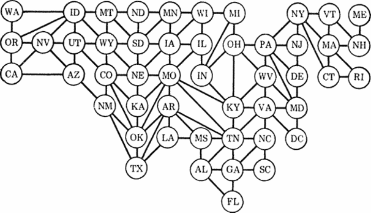
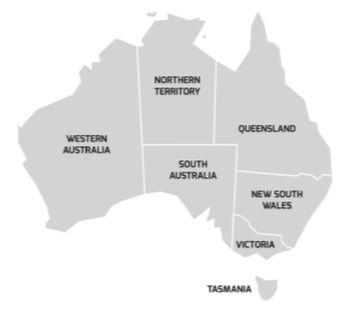
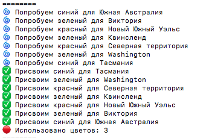
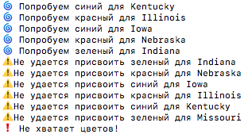
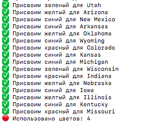

# Теорема о четырёх красках
Теорема, утверждающая, что всякую расположенную на плоскости или на сфере карту можно раскрасить не более чем четырьмя разными цветами (красками) так, чтобы любые две области с общим участком границы имели разный цвет.
____
Необходимо написать программу, раскрашивающую карту в минимальное число цветов. Исходными данными служит список регионов с указанием соседей каждого региона. Результатом должен быть список регионов с приписанными им цветами и общее число использованных цветов.


В задании дана карта США, состоящая из 51 штата. Её возможно раскрасить в 4 цвета. 


Мной была добавлена карта Австралии, разделённая на регионы, для раскрашивания которой достаточно 3 цветов.

____
### Запуск
```
python3 map.py
```
____
### Работа
В переменной colors - 3 цвета.
```
colors  = {'красный', 'зеленый', 'синий'}
```
#### Результат работы для карты Австралии с тремя доступными цветами


#### Результат работы для карты США с тремя доступными цветами


Изменим colors, добавив ещё один цвет.
```
colors  = {'красный', 'зеленый', 'синий', 'желтый'}
```
#### Результат работы для карты США с четырьмя доступными цветами

